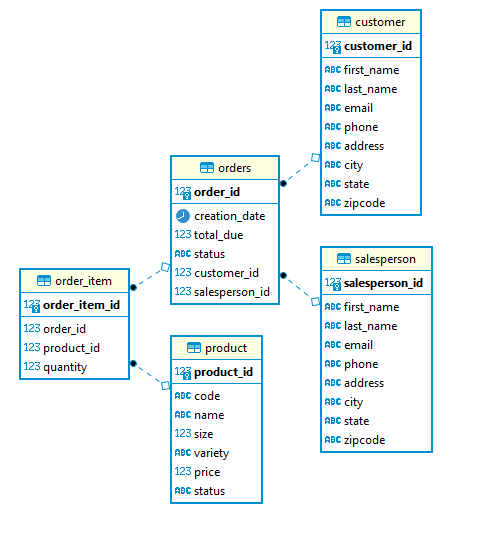

# Introduction
This project was an implementation of a DAO in the terms of Customer and Orders demonstrating
how they are connected to DTOs and how the abstraction layer is connected. CRUD operations were
used on the project and DAOs.

# Implementation
## ER Diagram

## Design Patterns
DAO (Data Access Object) is used to isolate the application/business layer from the persistence
layer using an abstract API which contains a DTO (Data Transfer Object) that is the 
model of the object in the DAO.

Whereas the Repository Pattern is a layer between the Business layer and Data layer. It is when you
need/want to aggregate data from different sources to allow you to avoid the use of repeating code.
# Test
I tested the application by creating, updating my own customers and orders into the database
that was created using the `psql` CLI tool on a postgres Image running on a container. I would
check the data using the CLI tool to make sure everything was proper.