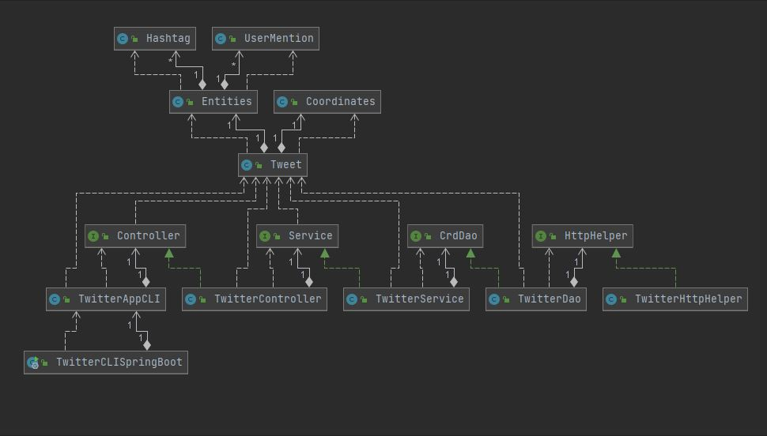

# Introduction
This application is a Twitter Command Line Interface to enable the creation, searching, and deletion of tweets based on their specified options. It uses the Twitter REST API to enable this functionality through an HTTP Client to run the requests and uses the Jackson library to parse and convert the JSON objects to Tweet Objects and vice-versa. I used Maven to package the application and its dependencies and then created a Docker image and pushed it to the Docker Hub.

# Quick Start
- Package the app with Maven: `mvn clean package -Dmaven.test.skip=true`
- Run your app with docker: 
```
docker run --rm \
-e consumerKey=YOUR_VALUE \
-e consumerSecret=YOUR_VALUE \
-e accessToken=YOUR_VALUE \
-e tokenSecret=YOUR_VALUE \
barlowza/twitter post|get|delete [options]
```

# Design
## UML diagram


In the application there are a few components to talk about:
* ### App/Main
This is the component that creates the IoC container for the SpringBoot application and initializes and injects their dependencies.
* ### Controller
The controller layer takes the arguments and parses them to validate they are in the correct format before sending them to the service layer.
* ### Service
The service layer contains the business logic of the application, it is the layer that validates the actual information in the arguments to ensure proper standards (i.e. text < 140 characters).
* ### DAO
The DAO layer is the Data Access Layer, it communicates with the HTTP Client and the Twitter Rest API to create DTOs and according to the specifications.
## Models
* ### Tweet Model
```json
{
   "created_at":"Mon Feb 18 21:24:39 +0000 2019",
   "id":1097607853932564480,
   "id_str":"1097607853932564480",
   "text":"test with loc223",
   "entities":{
      "hashtags":[],
      "user_mentions":[]  
   },
   "coordinates":null,   
   "retweet_count":0,
   "favorite_count":0,
   "favorited":false,
   "retweeted":false
}
```
* ### Coordinates Model
```json
{
  "coordinates": [],
  "type": null
}
```
* ### Entities Model

```json
{
  "hashtags": [],
  "user_mentions": []
}
```

* ### Hashtag Model

```json
{
  "indices": [],
  "texts": null
}
```
* ### User Mentions Model

```json
{
  "name": null,
  "indices": [], 
  "screen_name": null,
  "id":  null,
  "id_str": null
}
```
## Spring
The dependencies of the application are handled using the Spring framework. I used Java class 
annotations to signify the beans and their use cases as well as used the tag `@Autowired` 
to inject their dependencies via the constructor. In this case, I organized the components as followed:
  * `@Component`: `TwitterAppCLI`, `TwitterHttpHelper`
  * `@Controller`: `TwitterController`
  * `@Service`: `TwitterService`
  * `@Repository`: `TwitterDAO`

# Test
To test the entire application I created individual integration and unit tests for each component in the process. 
I used JUnit4 for the integration tests and both JUnit4 and Mockito 
for unit tests to create mocks of the Objects to test for correct results.

## Deployment
I ran the command `mvn clean package -Dmaven.test.skip=true` to package the project and 
create a jar file for the Dockerfile to use when creating the image 
of the whole application. After creation, it was tested on the CLI and confirmed and pushed to the Docker Hub.

# Improvements
- Detect location rather than having to input "lng:lat" for creation of tweets.
- Allow for more retrieval of tweets using multiple or other fields rather than just id.
- Multiple tweet retrieval from a single user.
