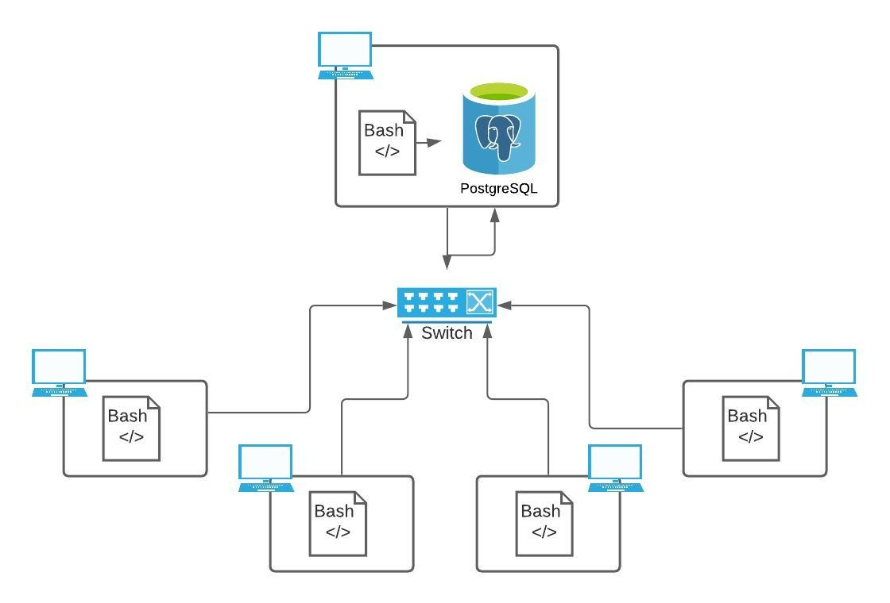

# Linux Cluster Monitoring Agent

# Introduction
The Jarvis Linux Cluster Administration (LCA) team manages a Linux cluster of 10 nodes/servers which are running CentOS 7. All of these servers are connected internally to each other through a switch and able to communication through interval IPv4 addresses.

The goal is to record the hardware specifications of each one of the nodes and monitor their individual usages in real-time. This data is collected by a crontab job every minute and store within a RDBMS database using PostgreSQL.

This data will be used to create reports for future research planning purposes and detect failures on specific hosts running.

The scripts to get the data and insert into the database are using bash and sql all running on a docker psql instance container running a CentOS7 image to run the automation process and the monitoring of the data. Using git as a resource version control for the project following the GitFlow ideologies.

# Quick Start
This is a simple quick start guide for you to implement and use the monitoring agent for your team or own system.
1. To start the instance, we have to create the docker container to run the CentOS image for our postgres database. Then we can start the container or stop the container whenever we want using the start/stop commands. The `[db_username][db_password]` are only needed for create tag.
```
$  ./scripts/psql_docker.sh start|stop|create [db_username][db_password]
```
2. Now we need to insert the tables `host_info, host_usage` into our newly created database `host_agent` by running the following command:
```
$ psql -h localhost -U postgres -d host_agent -f sql/ddl.sql
```
3. Before we start running the script continuously, we need to add the host machine's info to the table as it will be what is referenced in the usage table. Note, this command only needs to be run once.
```
$ ../scripts/host_info.sh psql_host psql_port db_name psql_user psql_password
```
4. This command is what gets the data on the specific usage that the machine is running with. To run this command use:
```
$ ./scripts/host_usage.sh psql_host psql_port db_name psql_user psql_password
```
5. Now that we have all the tables and container setup, we will use crontab to run the script every minute to rn the host_usage script which will be what we use to monitor our system's usage for any failures that may occur.
```
$ crontab -e

# in the file
* * * * * bash <pwd>/host_usage.sh psql_host psql_port db_name psql_user psql_password > /tmp/host_usage.log

# list the crontabs
$ crontab -l
```
## Architecture


## Database Modeling
**Table: host_info**
Column | Type | Description 
--------------|------|--------------
id | `SERIAL PK` | This is what will be used to identify the host
hostname | `VARCHAR` | The name of the host machine
cpu_number | `INTEGER` | Number of cpu(s)
cpu_architecture | `VARCHAR` | The system's bit instruction set
cpu_model | `VARCHAR` | The model of the cpu
cpu_mhz | `REAL` | Speed of cpu `mhz`
L2_cache | `INTEGER` | Storage of the L2 cache on the system `kB`
total_mem | `INTEGER` | The total memory on the machine `kB`
timestamp | `TIMESTAMP` | When the host was added to the table `UTC`


**Table: host_usage**
Column | Type | Description 
--------------|------|--------------
timestamp | `TIMESTAMP` | When the collection of data was taken `UTC`
host_id | `SERIAL FK` | The id of the host it is coming from
memory_free | `INTEGER` | The amount of memory that has not been used `MB`
cpu_idle | `REAL` | The percentage of cpu that is not being used
cpu_kernel | `REAL` | The perecentage of kernel cpu usage 
disk_io | `INTEGER` | number of disk I/O
disk_available | `INTEGER` | Available memory in root directory `MB`
