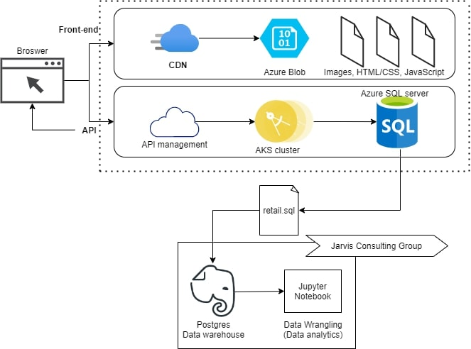

# Introduction
This is a project for the London Gift Shop (LGS) to help them undestand their customers better and how they can increase their sales and profits. Ultimately, the team uses the analytics provided by me to analyze their customer behaviour and shape their marketing strategies to attract new and existing customers.

In this Proof of Concept project, I used Python in a Jupyter Notebook with the help of Pandas, NumPy, Matplotlib, and Seaborn for the analytics as well as Docker for hosting data in a data warehouse.

# Implementaion
## Project Architecture

The LGS team has a front-end part and a back-end part of their application. Users use the front-end application to buy products which send an API request to the backend which stores the data into a database. The data is then exported via CSV or SQL files for the data warehouse to store and then can be used me or anyone else to do analytics on.

## Data Analytics and Wrangling
[Retail Data Analytics]('./retail_data_analytics_wrangling.ipynb')
- Total Invoice Amount Distribution
  - This is just to show the distribution of the data and the arrange of values.
- Monthly Placed and Cancelled Orders
  - The section finds the number of placed and cancelled orders placed in each month 
- Monthly Sales and Active Users
  - Finds and displays the monthly sales for each month as well as the percentage change for each month.
  - Calculates the number of active users each month to find when it is the most popular.
- New and Existing Users
  - Finds the total number of new and existing users to find out if they're getting new customers and how many are returning.
- RFM Segmentation
  - RFM is for recency frequency monetary.
  - Categorizes your customers into different segments, according to their interactions with your website, which will allow you to subsequently approach these groups in the most effective way

# Improvements
- Predictions on future sales
- Show which products are most bought and use that to make predictions
- Pipeline to continue to update data