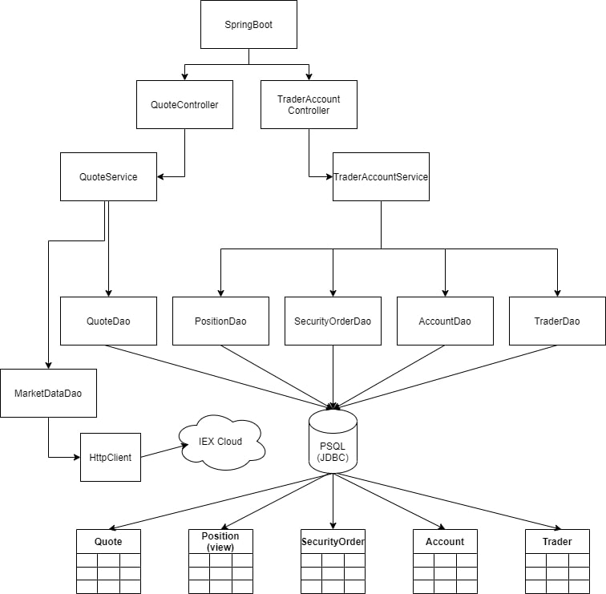
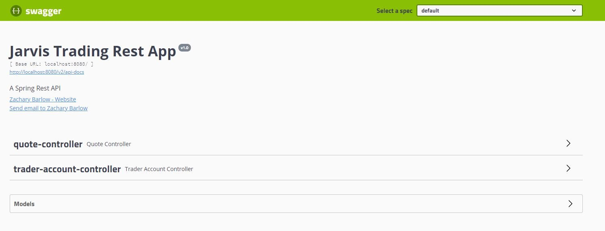
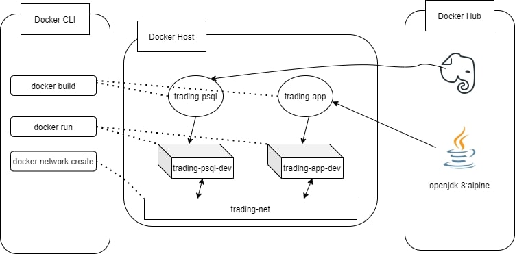

Table of contents
* [Introduction](#Introduction)
* [Quick Start](#QuickStart)
* [Implementation](#Implementation)
* [Test](#Test)
* [Development](#Development)
* [Improvements](#Improvements)

# Introduction
This is a Proof of Concept trading app that allows users to manage client profiles and accounts, monitor
portfolio performance, and trade securities. The Jarvis trading team wants to see if this project is
successful before it is transformed into a project using banking or exchange systems. It was implemented
using a three-tier architecture design with Java8 and Springboot to implement the REST API coming from
IEX Cloud to handle all the business and core logic of the application. The app is managed by Maven and 
uses Docker to create the images for further use and a Postgres database for storing the data.

# Quick Start
- Prerequisites: Docker, CentOS 7, IEX Pub Token
```
docker pull barlowza/trading-psql
docker pull barlowza/trading-app

docker network create --driver bridge trading-net

#Run database
docker run -d --rm --name trading-psql-dev \
-e POSTGRES_PASSWORD=password \
-e POSTGRES_DB=jrvstrading \
-e POSTGRES_USER=postgres \
--network trading-net \
-d -p 5432:5432 barlowza/trading-psql

IEX_PUB_TOKEN="YOUR_TOKEN"

#Run app
docker run -d --rm --name trading-app-dev \
-e "PSQL_HOST=trading-psql-dev" \
-e "PSQL_DB=5432" \
-e "PSQL_DB=jrvstrading" \
-e "PSQL_USER=postgres" \
-e "PSQL_PASSWORD=password" \
-e "IEX_PUB_TOKEN=${IEX_PUB_TOKEN}" \
--network trading-net \
-p 8080:8080 -t barlowza/trading-app
```
Then navigate to http://localhost:8080/swagger-ui.html to view and use the endpoints.
# Implemenation
## Architecture

The DTOs are organized as followed:
* Quote: 
```
  {
    id: Integer
    ticker: String
    lastPrice: Double
    bidPrice: Double
    bidSize: Integer
    askPrice: Double
    askSize: Integer
  }
```
* SecurityOrder
```
  {
    id: Integer
    account_id: Integer
    status: String
    ticker: String
    size: Integer
    price: Double
    notes: String
  }
```
* Account
```
  {
    id: Integer
    trader_id: Integer
    amount: Double
  }
```
* Trader
```
  {
    id: Integer
    firstName: String
    lastName: String
    country: String
    email: String
    dob: Date
  }
```
* Position (View)
```
  {
    account_id: Integer
    ticker: String
    sum(size) AS position: Integer
  }
```
- **Controller layer**: This layer sets up the endpoints that users want to reach and then returns
  the response from the service layer back in JSON format.
- **Service layer**: This is the business layer, it takes the incoming data and sends it to the DAO layer,
  then changes the format and sends it back to the controller layer.
- **DAO layer**: This layer deals with the access of data in the database and API. It updates, deletes, and creates
  the information in the tables.
- **PSQL and IEX**: This layer holds the data in a postgres database, and the IEX API to fetch the market data.
- **Springboot**: Springboot is used to set up our dependencies for our IoC in the application using annotations for the layers.
The role of Tomcat is to allow us to access the data with the requests and use Swagger for a web app.

## REST API Usage
### Swagger
Swagger is an Interface Description Language for describing RESTful APIs expressed using JSON. We are using it
for easier use in testing endpoints.

### Quote Controller
- This controller allows users to get daily quotes, add new ones, and update quotes individually or as an entire 
  table. The IexQuotes come from the IEX api and parsed and saved into a PSQL database.
    - GET `/quote/dailyList`: Show the dailyList.
    - GET `/quote/iex/ticker/{ticker}`: Show IexQuote.
    - POST `/quote/tickerId/{tickerId}`: Add a new ticker to the dailyList (quote table).
    - PUT `/quote/`: Update a given quote in the quote table.
    - PUT `/quote/iexMarketData`: Update quote table using iex data.

### Trader-Account Controller
- This controller and endpoints control the management of Traders and their accounts. 
  Allows the creation of traders and accounts, and for them to withdraw and deposit funds to the account.
  - DELETE `/trader/traderId/{traderId}`: Delete a trader.
  - POST `/trader/firstname/{firstname}/lastname/{lastname}/dob/{dob}/country/{country}/email/{email}`: Create a trader and an account.
  - PUT `/trader/deposit/traderId/{traderId}/amount/{amount}`: Deposit a fund.
  - PUT `/trader/withdraw/traderId/{traderId}/amount/{amount}`: Withdraw a fund.

# Test
To test the application I used JUnit4 to create integration tests on all the DAOs and services with a 
code coverage of atleast 70% for all files tested.

# Deployment

- trading-psql: This image contains the sql statements and pulls the postgres image.
- trading-app: This image first builds the application using maven to create a jar file then uses it as
  an entrypoint is set up so that when a container of trading-app is run, the jar file is executed.
# Improvements
If you have more time, what would you improve?
- Update the daily list every so often and data in quote database every so often
- Login as a Trader to manage accounts
- Implement Orders and a dashboard
